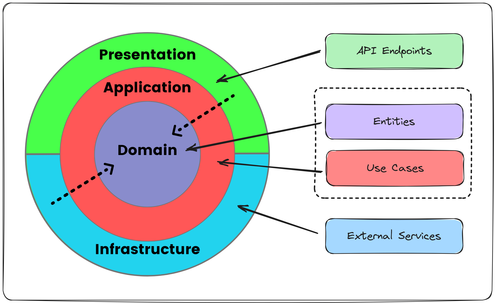

# Projet de Qualifications Développeur

## Description

Ce projet a pour objectif de participer à des qualifications de développeur.  
L'idée principale est de garder une approche simple, claire et facile à comprendre, tout en respectant les bonnes pratiques.

Ce projet sert donc à démontrer des compétences techniques de manière concise et efficace.

---

## Architecture

Le projet suit une architecture simple et modulaire.  

> *Un schéma d’architecture est ajouté ci-dessous pour mieux visualiser les différentes parties et leur interaction.*

---